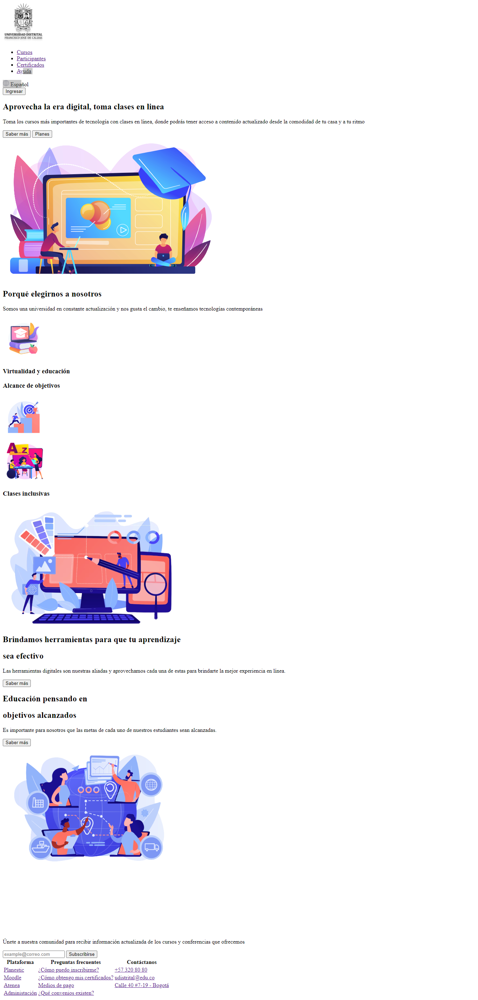
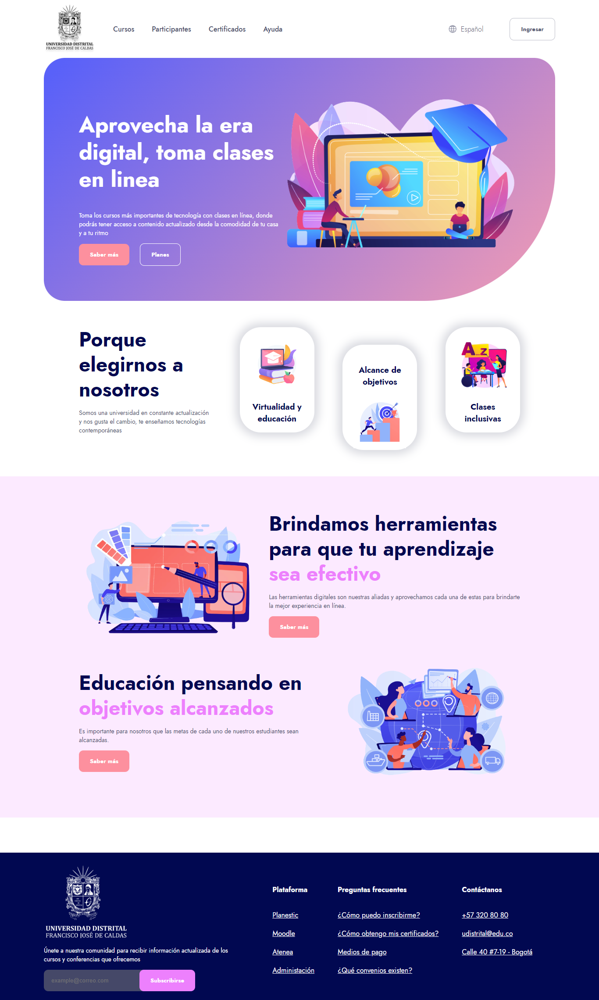
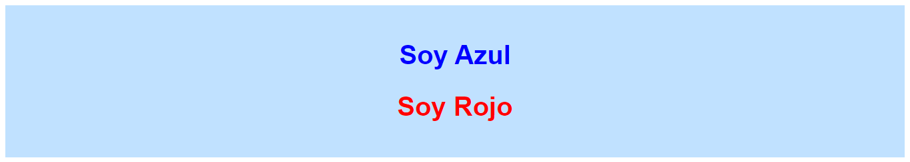

<h1>Taller 9 - Fabian Esteban Bonilla Celis</h1>

<h2>Información</h2>

Curco: Full Stack Básico - Grupo 1

Profesor: Cristian Patiño
 

<h2>Link de la página web</h2>

<a href="https://classicx06.github.io/taller-9/">link de Página web</a>

<h2>Punto 1: Link de Figma</h2>

<a href="https://www.figma.com/file/tqoWkOhBqpx4ALWYxQuxvs/Fabian-Esteban-Bonilla-Celis?type=design&node-id=0%3A1&mode=design&t=Eih6nqDK9Tiy5gzo-1">link de Figma</a>

<h2>Punto 2: Diseño en HTML</h2>

<h2>Punto 3: Diseño en CSS</h2>

<h2>Punto 4: Titulos</h2>

<h2>Punto 5: Párrafo</h2>

<h2>Punto 6: Links</h2>

<h2>Punto 7 y 8: Navegación</h2>

